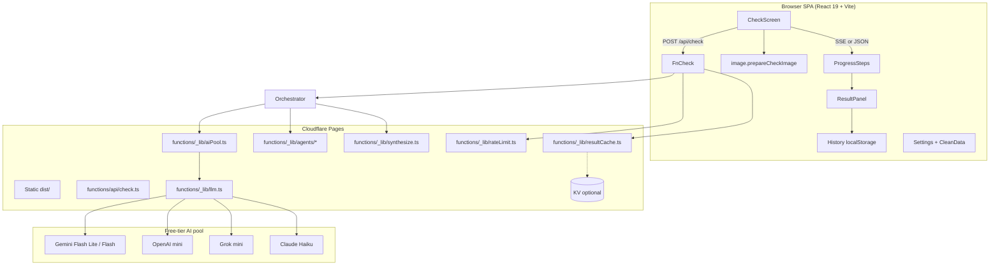

# OriginWise — China-Related Product / Brand / Origin Checker

| Field | Value |
|-------|--------|
| **Product name** | **OriginWise** (final) |
| **Repo / workspace** | `cn-related-check` |
| **Author** | _TBD_ |
| **Date** | 2026-08-02 |
| **Status** | **Approved for implementation** (rev 4 — product-owner decisions locked) |
| **Primary reference** | BabyWise (sibling *Wise-family app; Cloudflare Pages SPA + Functions patterns) |
| **Deploy target** | Cloudflare Pages (SPA + Pages Functions) |
| **Scaffold model** | **Inspired by BabyWise, not a fork/submodule** — greenfield code, ported patterns |

---

## Overview

**OriginWise** is a local-first progressive web app that helps users check whether a product, food item, brand, or company is related to the **People’s Republic of China (PRC)** — covering place of origin, manufacturer origin, company ownership/relations, and similar brand/product alternatives. Users submit a product name and/or a packaging/label photo; the server runs a **multi-agent AI pipeline** (identify, product, company, verify, alternatives) across a **free-tier AI provider pool**, then a **deterministic TypeScript synthesizer** builds a structured `CheckResult` (relation tier, explainable factors, origin regions, company graph, alternatives).

The app reuses BabyWise’s proven stack and security model (React 19 + Vite + TypeScript, Cloudflare Pages SPA + `functions/`, localStorage-only history/settings, client image compress, server-built prompts, multi-provider LLM keys, Cache API rate limits, EN + zh-Hant i18n). The core differentiator vs BabyWise’s single-shot Ask is **orchestrated multi-agent fan-out with progress streaming** and pure-TS tier synthesis — not a monolithic LLM call.

```
Browser (SPA)  →  localStorage (history, settings)
               →  POST /api/check  →  Orchestrator (CHECK_MODE: multi | dual | monolith)
                                      ├─ Agent: Identify (vision once, if needed)
                                      ├─ Agent: Product
                                      ├─ Agent: Company
                                      ├─ Agent: Verify
                                      └─ Agent: Alternatives (if dimensions request)
                                      →  Pure-TS synthesize → CheckResult
               →  SSE progress events (or single JSON)
```

---

## Background & Motivation

### Current state

- Workspace `cn-related-check` is **greenfield** (design docs only; no app code to migrate).
- BabyWise demonstrates a production-ready *Wise-family* pattern: mobile-first cards, bottom nav, local-first storage, hardened `/api/ask`, free-tier multi-provider LLM pool.
- No separate “combowise” repo was found; treat ComboWise as the same product-family UX lineage (mobile-first, local-first, Cloudflare Pages) referenced in BabyWise `docs/DEPLOY.md`.

### Pain points this product addresses

1. **Fragmented research** — Checking origin / ownership / alternatives today requires multiple search engines, brand sites, and news articles.
2. **Packaging literacy** — Labels use codes, mixed languages, and manufacturer legalese that are hard to parse quickly (especially on mobile).
3. **Trust & cross-check** — Single LLM answers hallucinate corporate ownership; a dedicated **verification agent** plus **deterministic tier rules** reduce silent inconsistency.
4. **Cost control** — Naive multi-call chains exhaust free AI tiers and Workers **CPU/subrequest** budgets; needs parallel-or-sequential schedules, call budget, caching, and job-level rate limits.

### Why not fork BabyWise

This is a **new product**, not a pregnancy diary. Domain types, prompts, result UI (graphs, relation tiers), and API (multi-agent job + progress) diverge enough that scaffolding *inspired by* BabyWise is cleaner than a fork merge.

---

## Goals & Non-Goals

### Goals

1. Deploy to **Cloudflare Pages** (static SPA + Pages Functions under `functions/`).
2. **Text and/or photo** check input (camera + gallery), with client-side compress (BabyWise `prepareAskImage` pattern).
3. Cover: product/food place of origin; manufacturer origin; company relations to PRC; similar brand alternatives; similar product alternatives.
4. **Multi-agent orchestration** with shared workload (not one monolithic query by default).
5. **AI free-tier pool** — distribute agent tasks across configured providers; degrade gracefully to **single-key sequential or monolith**.
6. **Speed** via parallelism (when multi-provider), optional cache, cheap first-pass, streaming progress.
7. **Rich result UI**: relation tier, **tier reasons**, origin map/chips, company relation graph, alternatives cards, confidence + caveats.
8. **Processing screen** showing per-agent progress.
9. **Past query history** (local only; BabyWise Ask history pattern).
10. **Settings + Clean Data** (selective wipe; BabyWise `CleanDataPanel` pattern).
11. Privacy: no accounts; photos not stored server-side; history local only.
12. Clear **informational disclaimer** — knowledge-cutoff / non-authoritative; not legal/sanctions advice; AI can be wrong.

### Non-Goals (v1)

- User accounts, sync, or server-side history database.
- Authoritative customs/trade/sanctions database or legal compliance tool.
- Real-time corporate registry scraping (LLM knowledge only in v1).
- Paid-only / high-cost frontier models as default path.
- Durable Objects job store as hard dependency for v1.
- Native mobile apps (PWA is enough).
- Crowdsourced product catalog (optional later).

---

## Product name

**Final decision: OriginWise.**

Ship under **OriginWise** in code (`originwise_v1_*` storage prefix, package name `originwise`; repo may remain `cn-related-check`). Rejected alternatives (ChinaCheck, SupplyWise, BrandTrace, RelateCN) are historical only.

---

## Proposed Design

### High-level architecture



### Stack (inspired by BabyWise — not a fork)

| Layer | Choice | BabyWise reference |
|-------|--------|-------------------|
| UI | React 19 + Vite 8 + TypeScript | `package.json` |
| Icons | lucide-react | same |
| Lint | oxlint | same |
| Deploy | Cloudflare Pages, `dist/` + `functions/` | `docs/DEPLOY.md` |
| Dev | `npm run pages:dev` = build + `wrangler pages dev dist` | `package.json` scripts |
| Storage | localStorage only | `src/core/storage/*` |
| i18n | EN + zh-Hant message trees | `src/core/i18n/*` |
| LLM | Server secrets only; env names aligned with BabyWise | `functions/_lib/llm.ts` |
| Rate limit | Cache API per IP; **host/namespace renamed** to `originwise-rate-limit.internal` / `check-*` | `functions/_lib/rateLimit.ts` |

**Divergence:** BabyWise lets the **client choose** Ask provider; OriginWise uses a **server-side AI pool** (client does not select provider in production). BabyWise has no SSE.

### Cloudflare Free-tier hard limits (platform)

HTTP wall-clock time is **not** a Free-plan hard cap while the client stays connected (streaming keeps the invocation alive; a ~100s silence can trigger 524-style errors). Implementers must design around:

| Limit | Free-tier (approx.) | Design implication |
|-------|---------------------|-------------------|
| **CPU time** | ~**10 ms** per request (network wait does **not** count) | JSON parse + graph synthesize must stay light; no heavy CPU graph layout server-side |
| **Subrequests** | **50** per request | Each LLM `fetch` = 1 subrequest; cache match/put count; stay well under (≤10 LLM + few cache ops) |
| **Simultaneous open connections** | **6** | Max parallel LLM fan-out **3** leaves headroom |
| **Memory** | **128 MB** | Do not buffer huge images twice; stream responses |
| **Requests / day** | **100k** account-level (Workers/Pages) | Public demo OK; still protect AI keys via job rate limits |

**Product timeouts (not platform law):**

| Policy | Value |
|--------|--------|
| Per-LLM abort | **12s** `AbortSignal` |
| Soft UX wall-clock target (text) | **~12s** full result p50 |
| Soft UX wall-clock target (image) | **~8–20s** full result p50 |
| Heartbeat during SSE waits | every **12s** comment event |

If CPU time becomes a problem in practice, escalate to paid Workers — do not “fix” by inventing a 25s wall-time platform limit.

### Multi-agent pipeline

#### Agent roles

| Agent ID | Aim | Inputs | Outputs (structured partial) | Vision? |
|----------|-----|--------|------------------------------|---------|
| `identify` | Normalize product/brand from text and/or image | text, optional image | `IdentifyPartial` | **Yes** (if image; only vision call) |
| `product` | Production / origin info | entity (+ OCR/text cues from identify only) | `ProductPartial` | **No** (v1) |
| `company` | Ownership / HQ / parents / PRC relations | entity brand/company | `CompanyPartial` | **No** |
| `verify` | Cross-check product vs company; confidence | product + company partials | `VerifyPartial` | **No** |
| `alternatives` | Similar brands + products | entity + product + company | `AlternativesPartial` | **No** |
| `synthesize` | **Pure TypeScript** merge → `CheckResult` | all partials + dimensions | full `CheckResult` | N/A (no LLM in default path) |

If label text is needed downstream, **pass OCR/entity strings from identify only** — never re-attach the image.

#### Orchestration policy (**Policy B** — v1 locked)

Orchestration is deterministic TypeScript in `functions/_lib/orchestrator.ts`. **v1 uses Policy B** (defer alternatives until after product+company). **Never re-run** an agent for “richer context.”

```
1. Rate-limit + origin check (+ in-flight lock acquire)
2. Parse body (size caps); generate jobId
3. Cache lookup (unless forceRefresh)
4. identify — see identify heuristic below
5. Wave A (parallel, max 2): product + company   [skipped per dimensions]
6. verify (LLM if both product & company present and call budget allows;
          else pure-TS heuristic verify)
7. alternatives — only if dimensions include alt_brands or alt_products
   and call budget remains; uses product+company context (no second pass)
8. pure-TS synthesize → CheckResult
9. Release in-flight lock (always in finally)
```

##### Identify skip/run heuristic (v1 locked)

| Condition | Run `identify`? |
|-----------|-----------------|
| Image present (with or without text) | **Always yes** (vision; only vision call) |
| No image, `text.trim().length ≥ 2` | **No** — use sanitized text as entity name/brand seed |
| No image, text empty or length &lt; 2 | **No** — `bad_request` (need text or image) |
| Optional later (not v1) | Re-enable identify for vague patterns (`this`, `what is this`, single CJK char, etc.) |

Entity when identify skipped: `{ name: text.trim().slice(0, 80), brand: null, category: null, confidence: 0.7 }`.

**Call accounting (hard caps):**

| Constraint | Budget |
|------------|--------|
| Max LLM calls per job | **4** default env; hard cap **5** |
| Max parallel LLM calls | **3** (multi-provider); **1** in single-provider sequential mode |
| Image | Only on `identify` |

| Path | Calls | Schedule |
|------|-------|----------|
| Text, all dimensions | 4 | product ‖ company → verify → alternatives |
| Text, no alternatives | 3 | product ‖ company → verify |
| Image, all dimensions | 5 | identify → product ‖ company → verify → alternatives |
| Image, no alternatives | 4 | identify → product ‖ company → verify |
| Image + identify fails | fail job if no text | see [Partial failure](#partial-failure--degraded-success-contract) |
| Single provider multi | ≤5 sequential | same order, no parallel fan-out |
| `CHECK_MODE=monolith` (any dims) | **1** | single structured multi-part prompt |
| `CHECK_MODE=dual` + alt dims on | **2** | combined product+company → alternatives |
| `CHECK_MODE=dual` + alt dims off | **1** | combined product+company only |

```mermaid
sequenceDiagram
  participant U as Client
  participant O as Orchestrator
  participant Pool as AI Pool
  participant P as product
  participant C as company
  participant V as verify
  participant A as alternatives
  participant S as synthesize TS

  U->>O: POST /api/check {text?, image?, locale, dimensions, forceRefresh?}
  O->>O: jobId + rate limit + origin + (cache?)
  O-->>U: SSE progress heartbeat ready
  opt image present (identify always; text-only skips identify)
    O->>Pool: identify (vision)
    Pool-->>O: entity
    O-->>U: progress identify done
  end
  par Wave A
    O->>P: product
    O->>C: company
  end
  P-->>O: product partial
  C-->>O: company partial
  O-->>U: progress product/company
  O->>V: verify
  V-->>O: verification
  opt alt dimensions on and budget left
    O->>A: alternatives (with product+company)
    A-->>O: alternatives
    O-->>U: progress alternatives
  end
  O->>S: synthesize (deterministic)
  S-->>O: CheckResult
  O-->>U: event result
```

#### Dimensions → agent pruning (**hard skip**)

Dimensions are **not** UX-only. They **hard-skip** agents and shape prompts.

| Dimension | Enables / requires |
|-----------|-------------------|
| `origin` | `product` agent (origin/made-in fields) |
| `manufacturer` | `product` agent (manufacturer block) |
| `company_relations` | `company` agent |
| `alt_brands` | `alternatives` agent (brands list) |
| `alt_products` | `alternatives` agent (products list) |

**Rules:**

- **Default dimensions (v1, locked):** `origin`, `manufacturer`, `company_relations` only — **not** `alt_brands` / `alt_products` (alternatives are **opt-in**).
- User enables alternatives via Settings (`defaultDimensions` includes alt_*) and/or per-check UI toggle.
- If **neither** `origin` nor `manufacturer` → skip `product` agent.
- If no `company_relations` → skip `company` agent.
- If neither `alt_brands` nor `alt_products` → skip `alternatives` agent (default path).
- `verify` runs only when **both** product and company agents ran and produced parseable partials; else TS heuristic on whatever exists.
- `identify` is independent of dimensions (needed for image → entity).
- At least one of product/company/alternatives must remain after pruning; otherwise `bad_request`.

#### `CHECK_MODE` enum

| Mode | Behavior |
|------|----------|
| `multi` (default when ≥2 providers **or** sequential single-provider) | Policy B multi-agent |
| `dual` | **1–2** LLM calls: combined product+company JSON, then alternatives **only if** alt dims on (else stop at 1) |
| `monolith` | **1** LLM call always: single prompt returning full structured payload; TS still normalizes + applies tier table |

Auto-selection:

1. Env `CHECK_MODE` forces mode if set.
2. Else if **1 configured provider** → `multi` **sequential** (not concurrent) on that provider; operator may set `CHECK_MODE=monolith` for lowest latency.
3. Else if ≥2 providers → `multi` with cross-provider parallel Wave A.

#### Pure-TS synthesize & **relationTier decision table** (critical)

`functions/_lib/synthesize.ts` is the **source of truth** for overall tier. LLMs must **not** set final `relationTier`; they only emit facts/partials. Synthesize:

1. Normalize countries → `RegionCode` (`CN` | `HK` | `TW` | `MO` | `OTHER` | `UNKNOWN`).
2. Collect **relation factors** from product + company + verify.
3. Apply decision table → `relationTier` + `tierReasons[]`.
4. Build graph nodes/edges (capped).
5. Set `confidence` from verify (or min of available confidences; default 0.35 if none).
6. Merge caveats; always set `disclaimerKey`, `knowledgeCutoffNote`, `schemaVersion: 1`.

##### Geographic policy (Key Decision #15 — user toggle)

Settings and per-check request carry:

```ts
type GeoScope = 'prc' | 'greater_china';
// default: 'prc'
```

| `geoScope` | Regions that count as “China-related” for tier factors / `chinaRelated` |
|------------|------------------------------------------------------------------------|
| **`prc` (default)** | **Mainland PRC (`CN`) only** |
| **`greater_china`** | `CN` + **`HK` + `MO` only** (same strength rules as CN for made-in/HQ/ownership factors). **Never includes `TW`.** |

| Region | Always in UI | Tier behavior |
|--------|--------------|---------------|
| **PRC (`CN`)** | Yes | Always can drive direct/indirect under both scopes |
| **Taiwan (`TW`)** | Always labeled as **country / distinct region** | **Never** in China-relation scope under either `geoScope`. Made-in/HQ TW alone → `none` (non-CN country) + optional note “Taiwan treated as separate country”. |
| **HK / MO** | Distinct region chips | Under **`prc`**: do **not** alone force `direct`/`indirect`; jurisdiction caveat. Under **`greater_china`**: treated like CN for `F_*_CN` factors |
| Other | `OTHER` | Non-related geo via `F_EXPLICIT_NON_CN_GEO` when outside active scope |

**Synthesize must read `geoScope` from the job** (client sends settings value on each check; server defaults to `prc` if omitted). Factor extraction uses **active scope set** `S`:

- `S_prc = { CN }`
- `S_greater = { CN, HK, MO }`  (**TW is never in S**)

CN-positive factors fire when region ∈ `S`. `F_EXPLICIT_NON_CN_GEO` / `isNonCnGeo` means region is defined, not `UNKNOWN`, and **not** ∈ `S`.

##### Factor extraction (boolean flags)

**Region helper (scope-aware):** given active set `S` from `geoScope`:

- `inScope(r)` = region is defined and ∈ `S`
- `isOutOfScopeGeo(r)` = region is defined, not `UNKNOWN`, and **not** ∈ `S`
- `UNKNOWN` / missing does **not** count as out-of-scope geo

Factor IDs keep `*_CN` names for stability; semantics mean **“in active China-related scope `S`”** (PRC-only or Greater China).

| Factor ID | True when |
|-----------|-----------|
| `F_MADE_IN_CN` | made-in or manufactured-in region `inScope` |
| `F_ORIGIN_CN` | product origin region `inScope` |
| `F_MFG_CN` | manufacturer region `inScope` |
| `F_HQ_CN` | company HQ region `inScope` |
| `F_PARENT_CN_MAJORITY` | any parent with region `inScope` and `control: 'majority' \| 'wholly'` |
| `F_OWNERSHIP_STRONG_CN` | any `chinaRelations` with type in strong set, `strength: 'strong'`, and country/region in scope (or unspecified country treated cautiously only if description implies scope — prefer region match) |
| `F_OWNERSHIP_WEAK_CN` | chinaRelations weak/moderate only for in-scope links |
| `F_COMPONENT_CN` | components/assembly/supply in scope without full made-in claim |
| `F_EXPLICIT_NON_CN_GEO` | **≥1** usable geo signal is out-of-scope: any of made-in / origin / manufacturer / HQ / majority-parent where `isOutOfScopeGeo(region)` |
| `F_NO_CN_LINK` | **stronger full picture:** `F_EXPLICIT_NON_CN_GEO` **and** no CN-positive factors **and** (when company data present) no in-scope parents/relations; product-side out-of-scope geo **and** company-side out-of-scope HQ when company partial exists |
| `F_CONFLICT` | verify says `consistent: false` with material conflicts |
| `F_INSUFFICIENT` | **no** CN-positive factors **and** **no** `F_EXPLICIT_NON_CN_GEO` |
| `F_CN_POSITIVE` | any of `F_MADE_IN_CN`, `F_ORIGIN_CN`, `F_MFG_CN`, `F_HQ_CN`, `F_PARENT_CN_MAJORITY`, `F_OWNERSHIP_STRONG_CN`, `F_OWNERSHIP_WEAK_CN`, `F_COMPONENT_CN` |
| `F_STRONG_CN` | any of `F_MADE_IN_CN`, `F_MFG_CN`, `F_HQ_CN`, `F_PARENT_CN_MAJORITY`, `F_OWNERSHIP_STRONG_CN` |

Strong ownership relation types: `parent_of`, `owned_by`, `controlling_shareholder`, `state_owned_cn`.  
Weak types: `minority_stake`, `supplier`, `assembled_in`, `retail_presence`, `licensed_in`, `joint_venture_minority`.

##### Decision table (first match wins, top to bottom)

| Priority | Condition | `relationTier` | Notes |
|----------|-----------|----------------|-------|
| 1 | `F_CONFLICT` **and not** `F_STRONG_CN` | `unknown` | Append verify conflicts to caveats |
| 2 | `F_STRONG_CN` | `direct` | Record matching factors in `tierReasons`. **Post-pass:** if also `F_CONFLICT`, keep `direct` but apply conflict confidence/caveats (see below) — do **not** use a separate unreachable priority |
| 3 | `F_ORIGIN_CN` (and not already direct) | `indirect` | Brand origin claim without strong mfg/HQ/ownership |
| 4 | `F_COMPONENT_CN` or `F_OWNERSHIP_WEAK_CN` | `indirect` | |
| 5 | **not** `F_CN_POSITIVE` **and** `F_EXPLICIT_NON_CN_GEO` | `none` | Clear non-PRC geo with no CN-positive factors. If company/ownership was skipped or failed → `tierReasons` + caveat *“ownership not assessed”*; `confidence = min(confidence, 0.55)` |
| 6 | `F_INSUFFICIENT` or nothing matched | `unknown` | No CN-positive **and** no usable non-CN geo |

**Post-pass (after tier chosen — always run):**

1. If chosen tier is `direct` **and** `F_CONFLICT` → `confidence = min(confidence, 0.45)`; append verify `conflicts[]` to `caveats`.
2. If tier is `none` **and** company agent missing/failed → force caveat *“Company/ownership data not assessed”*; add supporting `tierReasons` entry `ownership_not_assessed`.
3. TW-only geo → always `none` (country, never in S) under either scope. Under `geoScope: 'prc'`, HK/MO-only → `none` + jurisdiction caveat. Under `greater_china`, HK/MO-only → can be `direct`/`indirect` like CN.
4. Record `geoScope` used on `CheckResult` (or `meta`) so history UI can show which policy applied.

**Required unit tests (PR 4):**

| Case | Expected tier |
|------|----------------|
| madeIn=JP, no company, any scope | `none` + ownership-not-assessed caveat |
| HQ=US only, no product geo | `none` + product-origin-not-assessed caveat (symmetric) |
| madeIn=JP + HQ=CN | `direct` (`F_HQ_CN`) |
| No signals | `unknown` |
| madeIn=CN | `direct` |
| origin=CN only | `indirect` |
| strong in-scope + verify conflict | `direct` with confidence ≤ 0.45 |
| madeIn=TW, either scope | `none` (TW always a country; never in S) |
| madeIn=HK, `geoScope: 'greater_china'` | `direct` |
| madeIn=HK, `geoScope: 'prc'` | `none` + jurisdiction caveat |

**Confidence:**

- Base = `verification.confidence` if present, else average of partial confidences, else `0.4`.
- If tier from single weak factor → `min(confidence, 0.5)` and force a caveat.
- If degraded (agent failure) → `min(confidence, 0.4)` and `meta.degraded: true` (except priority-5 `none` with only missing company uses the 0.55 cap above when product geo is strong).
- Conflict+direct post-pass → `min(confidence, 0.45)`.

**Graph build (TS):**

- Nodes: product, brand, manufacturer, company, parents, countries (≤ **20** nodes).
- Edges: made_in, manufactured_by, owned_by, hq_in, brand_of, related_to (≤ **30** edges).
- Set `chinaRelated: true` on nodes/edges only for **PRC/CN** factors (not HK/TW/MO alone).
- Edge `strength`: `weak` | `moderate` | `strong` from relation type.

#### Prompt design principles (from BabyWise `buildSafetyPrompt`)

- **Server-built prompts only** — never trust client `fullPrompt`.
- Fence user content in `<user_item>` / `<entity>` tags; treat as untrusted DATA.
- Hardened anti-injection; refuse off-topic / jailbreaks.
- Force **JSON-only** per agent (frozen templates below).
- Locale: respond entirely in EN or Traditional Chinese based on `locale`.
- **Ownership humility:** prefer `null` / omit / `"unknown"` over fabrication for legalName, parents, ownership.
- Never claim legal certainty; include short caveat candidates.

#### Frozen agent JSON output templates (PR 4)

**identify**

```json
{
  "name": "string≤80",
  "brand": "string≤80|null",
  "category": "string≤40|null",
  "barcodeGuess": "string≤32|null",
  "ocrText": "string≤500|null",
  "confidence": 0.0
}
```

**product**

```json
{
  "name": "string≤80|null",
  "brand": "string≤80|null",
  "category": "string≤40|null",
  "originCountry": "ISO2|null",
  "madeInCountry": "ISO2|null",
  "manufacturedInCountry": "ISO2|null",
  "manufacturerName": "string≤80|null",
  "manufacturerCountry": "ISO2|null",
  "labelNotes": ["string≤120"],
  "confidence": 0.0,
  "caveats": ["string≤160"]
}
```

Field semantics:

| Field | Meaning |
|-------|---------|
| `originCountry` | Brand/product **origin claim** (where the brand/product is “from”) |
| `madeInCountry` | **Made in** / packaging “Made in X” |
| `manufacturedInCountry` | Factory / manufacturing location if distinct from made-in label |
| Prefer ISO 3166-1 alpha-2; unknown → `null` (not invented) |

Max: `labelNotes` ≤ 5, `caveats` ≤ 3.

**company**

```json
{
  "legalName": "string≤120|null",
  "brandOwner": "string≤120|null",
  "hqCountry": "ISO2|null",
  "parents": [{"name":"string≤80","country":"ISO2|null","control":"unknown|minority|majority|wholly"}],
  "chinaRelations": [{
    "type": "parent_of|owned_by|controlling_shareholder|state_owned_cn|minority_stake|supplier|assembled_in|retail_presence|licensed_in|joint_venture_minority|other",
    "description": "string≤200",
    "strength": "weak|moderate|strong",
    "country": "ISO2|null"
  }],
  "confidence": 0.0,
  "caveats": ["string≤160"],
  "knowledgeBasis": "model_memory_only"
}
```

Max: `parents` ≤ 5, `chinaRelations` ≤ 6, `caveats` ≤ 3.  
`knowledgeBasis` is always `model_memory_only` in v1 (no live registry).

**verify**

```json
{
  "consistent": true,
  "conflicts": ["string≤160"],
  "confidence": 0.0,
  "caveats": ["string≤160"]
}
```

Max: conflicts ≤ 5, caveats ≤ 3.

**alternatives**

```json
{
  "brands": [{"name":"string≤80","relationTier":"none|indirect|direct|unknown","reason":"string≤160","originCountry":"ISO2|null"}],
  "products": [{"name":"string≤80","relationTier":"none|indirect|direct|unknown","reason":"string≤160","originCountry":"ISO2|null"}]
}
```

Max: brands ≤ **6**, products ≤ **6**.  
When alternatives dims are enabled, suggest substitutes with **no / lower mainland-China involvement** (not merely similar peers). Prefer non-CN made-in + non-PRC ownership; drop high-CN fillers; still mark uncertain tiers honestly.

**Alternative `relationTier` is advisory (v1):** overall query tier is decision-table certified; each alternative’s `relationTier` is **LLM-emitted and not re-run through the factor table**. Synthesize must:

1. Clamp invalid/null tiers to `unknown`.
2. Set `alternativesMeta.tiersAdvisory: true` (or document on ResultPanel always).
3. UI label: **“Estimated relation”** (EN) / equivalent zh-Hant — not the same badge copy as overall certified tier.

Do **not** claim alternative cards are decision-table certified in v1.

**monolith / dual** combined schemas embed the same field sets so synthesize stays unified.

#### Shared context object

```ts
type AgentContext = {
  jobId: string;
  locale: 'en' | 'zh-Hant';
  queryText: string;          // sanitized, max 400
  entity?: NormalizedEntity;  // from identify or client text
  dimensions: CheckDimension[];
  /** From settings / request; default 'prc'. Synthesize + factor table must use this. */
  geoScope: 'prc' | 'greater_china';
  partials: Partial<AgentPartials>;
  ocrText?: string;           // from identify only
};
```

---

### AI pool manager

**File:** `functions/_lib/aiPool.ts` (builds on BabyWise `llm.ts`)

```ts
type ProviderId = 'gemini' | 'openai' | 'grok' | 'claude';

type PoolAssignment = {
  agentId: AgentId;
  provider: ProviderId;
  model: string;
  reason: 'role_pref' | 'spread' | 'fallback' | 'only_available' | 'sequential_single';
};

const ROLE_PREF: Record<AgentId, ProviderId[]> = {
  identify: ['gemini', 'openai'], // vision-capable first; see matrix
  product:  ['gemini', 'openai', 'grok', 'claude'],
  company:  ['openai', 'grok', 'claude', 'gemini'],
  verify:   ['grok', 'gemini', 'openai', 'claude'],
  alternatives: ['claude', 'gemini', 'openai', 'grok'],
};
```

#### Vision capability matrix (v1)

| Provider | Vision for identify | Notes |
|----------|---------------------|-------|
| gemini | **Yes** (preferred) | Flash Lite / Flash multimodal |
| openai | **Yes** | gpt-4o-mini image_url path (BabyWise) |
| grok | **No for v1 identify** | Do not list as identify fallback unless operator confirms model vision |
| claude | **Optional** | Haiku vision if configured; third choice after openai |

#### Selection algorithm

1. List configured providers (`providerConfigured`).
2. **`configuredCount === 1` → single-provider mode:**
   - Default: **sequential multi-agent** on that provider (no 3× concurrent free-tier hits).
   - Optional env `CHECK_MODE=monolith` for one-shot.
   - ROLE_PREF diversity is irrelevant; all assignments use the only key; `reason: 'sequential_single'`.
3. **`configuredCount ≥ 2`:** for each agent in a **parallel wave**, pick first preferred provider **not already assigned in this wave** (spread). “Busy” means **already assigned in this job wave only** — there is no cross-isolate in-memory busy map (Workers isolates are independent).
4. On `upstream_quota` / `upstream_unavailable`, **fallback once** to next provider (or next model in Gemini chain). No infinite retry.
5. Soft in-process: after N quota failures **in this job**, stop trying that provider for remaining agents. Cross-request disable requires env `POOL_DISABLE_PROVIDERS`.
6. Log every assignment into `meta.agents[]`.

#### Models (defaults — BabyWise-aligned env names)

| Provider | Default model | Env override |
|----------|---------------|--------------|
| gemini | free-tier chain: flash-lite → 3.5/3.1/2.5 lite → flash | `GEMINI_MODEL=auto` or pin |
| openai | free-tier chain: `gpt-5.4-mini` → `gpt-5.6-luna` → legacy mini → `gpt-5.5` last | `OPENAI_MODEL=auto` or pin |
| grok | free-tier chain: `grok-4.5` → `grok-4.3` → 4.20 non-reasoning → `grok-4` | `XAI_MODEL=auto` or pin |
| claude | free-tier chain: `claude-haiku-4-5` → dated haiku | `ANTHROPIC_MODEL=auto` or pin |

Extend BabyWise callers with:

- `callProviderJson(provider, prompt, env, image?, signal?)` → `extractJsonObject`.
- **12s** per-call abort.

---

### API surface

#### Design choice: single POST with optional streaming progress

- No long-lived multi-request job store without KV/DO for v1.
- SSE **from a single Function invocation** while client connected.
- Subrequest/CPU limits above — not a 25s wall-time platform cap.

**v1 primary:** `POST /api/check` with `Accept: text/event-stream` or `stream: true` → SSE.  
**v1 fallback:** `Accept: application/json` or `stream: false` → single JSON.  
**v1.1 optional:** jobId + KV poll if needed later.

#### `POST /api/check`

```ts
type CheckBody = {
  locale?: string;
  text?: string;                   // max 400
  image?: { mimeType?: string; data?: string };
  dimensions?: CheckDimension[];   // hard agent pruning; default core three
  /** PRC-only vs Greater China tier policy; default 'prc' */
  geoScope?: 'prc' | 'greater_china';
  /** Bypass result cache; still rate-limited */
  forceRefresh?: boolean;
  /** @deprecated ignored */
  fullPrompt?: string;
  stream?: boolean;
};

type CheckDimension =
  | 'origin'
  | 'manufacturer'
  | 'company_relations'
  | 'alt_brands'
  | 'alt_products';
```

**Processing order for abuse control:** origin check → rate limit / in-flight lock → **then** read/parse large JSON body (when platform allows early reject; if body already buffered by runtime, still apply size caps immediately after parse). Prefer rejecting rate-limited clients before expensive image base64 handling when possible.

#### SSE contract (production)

**Response headers (stream path):**

```http
Content-Type: text/event-stream; charset=utf-8
Cache-Control: no-store, no-transform
Connection: keep-alive
X-Accel-Buffering: no
```

**Event framing:** standard SSE (`event:` + `data:` JSON + blank line). All data payloads include `jobId`.

**Heartbeat:** SSE comment lines every **12s** while waiting on LLM: `: hb\n\n` — prevents ~100s idle 524s.

**Event order (guaranteed):**

1. Zero or more `progress` (and optional `partial`)
2. Exactly one terminal event: `result` **or** `error`
3. No events after terminal

**Event types:**

```text
event: progress
data: {"jobId":"...","step":"identify|product|company|verify|alternatives|synthesize","status":"pending|running|done|skipped|error","provider":"gemini|...","message":"...","ts":ISO}

event: partial
data: {"jobId":"...","agentId":"product","data":{...}}   // v1: optional; may omit entirely

event: result
data: {"ok":true,"jobId":"...","result":{...},"meta":{...},"limits":{...}}

event: error
data: {"ok":false,"jobId":"...","code":"rate_limited","error":"..."}
```

**Ordering of parallel completions:** progress `done` events may arrive in any order for Wave A; clients must not assume product-before-company.

**Client abort:** `fetch` + `AbortSignal`. On disconnect, Cloudflare cancels the Worker; orchestrator checks `signal.aborted` / `context.request.signal` **before scheduling each next agent** and stops further LLM calls.

**Client implementation notes:**

- Use `fetch` + `ReadableStream` (EventSource cannot POST).
- If no byte received for **45s** after open (or mid-stream stall > **45s** without heartbeat/event), abort and optionally retry once with `stream: false`.
- If `Content-Type` is `application/json`, parse as single-shot (no SSE).

**pages:dev checklist (PR 7):** confirm events flush before first LLM returns; confirm heartbeats; confirm JSON fallback.

#### Non-stream JSON success

```json
{
  "ok": true,
  "jobId": "01J…",
  "result": { "...CheckResult..." },
  "meta": {
    "schemaVersion": 1,
    "cached": false,
    "cachedAt": null,
    "degraded": false,
    "mode": "multi",
    "agents": [
      { "id": "product", "provider": "gemini", "ms": 1200, "ok": true },
      { "id": "company", "provider": "openai", "ms": 1400, "ok": true, "error": null }
    ],
    "totalMs": 4200,
    "llmCalls": 4
  },
  "limits": { "remainingMinute": 1, "remainingDay": 8 }
}
```

#### Partial failure / degraded success contract

| Situation | HTTP / `ok` | Behavior |
|-----------|-------------|----------|
| Origin forbidden / rate limit / bad request / no providers | 4xx/5xx, `ok: false` | Terminal error; no result |
| Image-only and `identify` fails | 502, `ok: false`, `parse_error` or `upstream_*` | Cannot proceed |
| Zero agents succeed (all LLM fail) | 502, `ok: false` | Error |
| ≥1 useful partial (product and/or company and/or alts) | **200, `ok: true`**, `meta.degraded: true` | Synthesize best-effort |
| Company agent fails; product ok | `ok: true`, degraded | Tier from product factors only via decision table: made-in CN → `direct`; explicit non-CN geo (e.g. JP) → **`none`** + ownership-not-assessed; no geo → `unknown` |
| Product fails; company ok | `ok: true`, degraded | Tier from company factors only: HQ non-CN → `none` (+ product-origin caveat); HQ CN → `direct` |
| Verify fails | `ok: true` | TS heuristic verify; confidence capped |
| Alternatives fail | `ok: true` | Empty alternatives arrays + caveat |

Failed agents appear in `meta.agents[]` with `ok: false` and public `error` code (no vendor internals).

#### `GET /api/check`

Pool health (no secrets): available providers, vision-capable list, rate-limit policy summary, `CHECK_MODE` effective default — mirror BabyWise `GET /api/ask`.

#### Error codes

| Code | HTTP | Meaning |
|------|------|---------|
| `forbidden_origin` | 403 | Origin/Referer not allowed |
| `rate_limited` | 429 | Per-minute job limit or in-flight limit |
| `rate_limited_day` | 429 | Daily job limit |
| `bad_request` | 400 | Missing text+image, bad image, empty dimensions, etc. |
| `provider_not_configured` | 503 | No AI keys configured |
| `parse_error` | 502 | Could not build structured result |
| `upstream_error` / `upstream_quota` / `upstream_unavailable` | 502/429 | Provider failures after fallback |
| `timeout` | 504 | Per-call or job soft budget exceeded with no usable partials |
| `server_error` | 500 | Unexpected |

---

### Client UI

#### Navigation (**v1 locked**)

**Bottom nav: Check | History** (primary tools only). **About** and **Settings** are top-level screens opened from **top-right icon buttons** (Buy me a pint chip optional). **How it works** is a sub-page of About (not a separate Info hub). Matches BabyWise shell navigation.

| Area | Screen |
|-----|--------|
| Check | `CheckScreen` — composer + progress; top-right About/Settings icons |
| History | `HistoryScreen` — full list; top-right icons |
| About | `AboutScreen` (top-level) → optional `HowItWorksScreen` |
| Settings | `SettingsScreen` + Clean Data (no About nest) |

#### CheckScreen (Ask-like)

- Textarea + camera (`capture="environment"`) + gallery.
- `prepareCheckImage` (BabyWise caps: max edge 1280, JPEG ~750KB target, 1MB hard).
- CTA “Check origin”.
- **ProgressSteps:** Identify → Product → Company → Verify → Alternatives → Synthesize (skip dimmed steps).
- Emit first progress as soon as stream opens (server sends `progress`/`ready` before any LLM await).
- Client mutex: **one in-flight check** in the UI (disable CTA).
- Force-refresh control (optional advanced): sets `forceRefresh: true`.

#### ResultPanel

| Block | Content |
|-------|---------|
| Header | Title + relation tier badge |
| Score strip | Tier + confidence + **tierReasons** (why this tier) |
| Origin card | origin / made-in / manufactured-in + **region chips** (CN/HK/TW/MO/OTHER) |
| Relation graph | SVG from `graph` (PRC-related edges highlighted) |
| Company card | legal name, HQ, parents, chinaRelations |
| Alternatives | Cards with **“Estimated relation”** advisory tiers (hidden if both alt dims off) |
| Caveats + disclaimer | Always show knowledge-cutoff note |
| Meta | jobId, agents, cached/cachedAt, degraded |

**Tier UI labels:** **Unrelated** (`none`) / **Partial** (`indirect`) / **Related** (`direct`) / **Unknown** — not medical green/amber/red copy.

#### HistoryScreen

- Cap **30** items; full `CheckResult` + `schemaVersion`; delete one / clean all via settings.

#### Settings + CleanDataPanel

**Settings controls (owner-locked defaults):**

| Control | Default | Notes |
|---------|---------|-------|
| Locale / theme | en / system-friendly | BabyWise pattern |
| **Geo scope** | **`prc`** | Toggle: PRC-only vs Greater China (`geoScope`) — affects tier synthesize |
| **Default dimensions** | origin + manufacturer + company_relations | Checkboxes; **alternatives off** until user enables `alt_brands` / `alt_products` |
| Per-check | inherits settings | CheckScreen may override dimensions / geoScope for one query |

| Category | Keys wiped |
|----------|------------|
| `checkHistory` | history |
| `settings` | settings |
| `all` | all `originwise_v1_*` + disclaimer ack |

#### Welcome disclaimer

Informational only; **not legal/sanctions advice**; AI knowledge-cutoff / non-authoritative; data local. Store `disclaimer_ack`.

---

## API / Interface Changes

Greenfield — module boundaries:

### Server

```
functions/
  api/
    check.ts
  _lib/
    rateLimit.ts          # port; host originwise-rate-limit.internal
    llm.ts
    aiPool.ts
    resultCache.ts
    orchestrator.ts
    synthesize.ts         # pure TS tier + graph
    agents/
      identify.ts
      product.ts
      company.ts
      verify.ts
      alternatives.ts
      monolith.ts         # CHECK_MODE=monolith|dual helpers
    prompts.ts
    schema.ts             # parse/normalize + caps
    security.ts
    regions.ts            # ISO2 → RegionCode
```

### Client

```
src/
  App.tsx
  components/
    CheckScreen.tsx
    ResultPanel.tsx
    ProgressSteps.tsx
    RelationGraph.tsx
    OriginMap.tsx
    AlternativeCards.tsx
    HistoryScreen.tsx
    SettingsScreen.tsx
    CleanDataPanel.tsx
    AboutScreen.tsx
    WelcomeDisclaimer.tsx
    BottomNav.tsx
    ui/
  core/
    types.ts              # duplicated from server schema (no monorepo package v1)
    ai/client.ts
    ai/engine.ts
    storage/keys.ts
    storage/store.ts
    util/image.ts
    i18n/
  hooks/useAppState.ts
```

**Shared types strategy (v1):** duplicate `CheckResult` types in `src/core/types.ts` and `functions/_lib/schema.ts` with a short comment “keep in sync”; optional later `shared/` package. PR 4 freezes both.

```ts
export async function runCheck(
  req: CheckRequest,
  opts?: { onProgress?: (e: ProgressEvent) => void; signal?: AbortSignal }
): Promise<CheckResponse>;
```

---

## Data Model Changes

### `CheckResult` (schemaVersion 1)

```ts
export type RelationTier = 'none' | 'indirect' | 'direct' | 'unknown';
export type RegionCode = 'CN' | 'HK' | 'TW' | 'MO' | 'OTHER' | 'UNKNOWN';
export type Strength = 'weak' | 'moderate' | 'strong';

export type ChinaRelationType =
  | 'parent_of'
  | 'owned_by'
  | 'controlling_shareholder'
  | 'state_owned_cn'
  | 'minority_stake'
  | 'supplier'
  | 'assembled_in'
  | 'retail_presence'
  | 'licensed_in'
  | 'joint_venture_minority'
  | 'other';

export type GraphNode = {
  id: string;
  label: string;
  kind: 'product' | 'brand' | 'company' | 'country' | 'parent' | 'manufacturer';
  countryCode?: string;
  region?: RegionCode;
  chinaRelated?: boolean; // PRC/CN only
};

export type GraphEdge = {
  from: string;
  to: string;
  relation:
    | 'brand_of'
    | 'manufactured_by'
    | 'owned_by'
    | 'hq_in'
    | 'made_in'
    | 'origin_of'
    | 'related_to';
  strength?: Strength;
  chinaRelated?: boolean;
  confidence?: number;
  note?: string;
};

export type TierReason = {
  factorId: string; // e.g. F_MADE_IN_CN
  label: string;    // localized-ready English/zh string from synthesize
  weight: 'primary' | 'supporting';
};

export type AlternativeItem = {
  name: string;
  kind: 'brand' | 'product';
  relationTier: RelationTier;
  reason: string;
  originCountry?: string;
  originRegion?: RegionCode;
};

export type CheckResult = {
  schemaVersion: 1;
  locale: string;
  /** Policy used for this result’s tier factors */
  geoScope: 'prc' | 'greater_china';
  title: string;
  summary: string;
  relationTier: RelationTier;
  tierReasons: TierReason[]; // explain “why this tier”; max 6
  confidence: number;        // 0–1
  regions: RegionCode[];     // normalized chips for OriginMap; max 8
  product?: {
    name?: string;
    brand?: string;
    category?: string;
    /** Brand/product “from” claim */
    originCountry?: string;
    originRegion?: RegionCode;
    /** Packaging Made-in */
    madeInCountry?: string;
    madeInRegion?: RegionCode;
    /** Factory location if distinct */
    manufacturedInCountry?: string;
    manufacturedInRegion?: RegionCode;
    labelNotes?: string[]; // max 5
  };
  manufacturer?: {
    name?: string;
    country?: string;
    region?: RegionCode;
    notes?: string[];
  };
  company?: {
    legalName?: string;
    brandOwner?: string;
    hqCountry?: string;
    hqRegion?: RegionCode;
    parents?: Array<{
      name: string;
      country?: string;
      region?: RegionCode;
      control?: 'unknown' | 'minority' | 'majority' | 'wholly';
    }>; // max 5
    chinaRelations?: Array<{
      type: ChinaRelationType;
      description: string;
      strength: Strength;
      country?: string;
      region?: RegionCode;
    }>; // max 6
    knowledgeBasis: 'model_memory_only';
  };
  graph: {
    nodes: GraphNode[]; // max 20
    edges: GraphEdge[]; // max 30
  };
  alternatives: {
    brands: AlternativeItem[];   // max 6
    products: AlternativeItem[]; // max 6
  };
  verification: {
    consistent: boolean;
    conflicts: string[];
    confidence: number;
    caveats: string[];
  };
  caveats: string[]; // max 8
  knowledgeCutoffNote: string; // fixed short EN/zh from server by locale
  disclaimerKey: 'informational_only';
  asOf: string; // ISO timestamp of synthesis
};
```

### Local storage

```ts
export const STORAGE_PREFIX = 'originwise_v1_';
export const STORAGE_KEYS = {
  settings: `${STORAGE_PREFIX}settings`,
  checkHistory: `${STORAGE_PREFIX}check_history`,
  disclaimerAck: `${STORAGE_PREFIX}disclaimer_ack`,
  resultCache: `${STORAGE_PREFIX}result_cache`,
} as const;

export type CheckHistoryItem = {
  id: string;
  query: string;
  hadImage: boolean;
  result: CheckResult;
  meta?: {
    jobId?: string;
    cached?: boolean;
    degraded?: boolean;
    providers?: string[];
    llmCalls?: number;
  };
  at: string;
};

export type GeoScope = 'prc' | 'greater_china';

export type AppSettings = {
  locale: Locale;
  theme: ThemeMode;
  preferredProvider?: ProviderId; // debug only
  /** Default: origin + manufacturer + company_relations (alts opt-in) */
  defaultDimensions: CheckDimension[];
  /** Default: 'prc'. User toggle in Settings: PRC-only vs Greater China for tiers */
  geoScope: GeoScope;
};
```

### Server result cache

| Key | Value | TTL |
|-----|-------|-----|
| `check:v1:{sha256(normalizeQuery(text)+locale+sortedDims+geoScope)}` | `{ result, cachedAt }` | default **86400s** (env) |

**normalizeQuery (required):**

1. Unicode NFKC  
2. trim, collapse whitespace  
3. lowercase  
4. strip `™ ® ©` and common punctuation noise  
5. optional brand alias map later (empty in v1)

- Text-only cacheable; image path caches **after** identify using `normalizeQuery(entity.name + ' ' + entity.brand)`.
- `forceRefresh: true` skips read (still may write).
- Cache hits **consume** a rate-limit job token (anti-scrape).
- `meta.cached` + `meta.cachedAt` always set when served from cache.
- Cache API is **best-effort per colo** (same limitation as BabyWise rate limits).

### Migration

Greenfield. Bump `schemaVersion` / storage prefix on breaking changes.

---

## Alternatives Considered

### 1) Single monolithic LLM call (BabyWise Ask style)

| Pros | Cons |
|------|------|
| Simplest; one subrequest | Weaker specialization; poorer progress UX; one quota sink |

**Not default** — retained as `CHECK_MODE=monolith` for single-key latency and emergency fallback.

### 2) Two-phase specialized calls (`CHECK_MODE=dual`)

| Pros | Cons |
|------|------|
| Better structure than monolith; only 2 LLM calls; Free-tier friendly | Less isolation than full multi; weaker verify story |

**Supported middle ground** between monolith and full multi — good rollback/ops mode.

### 3) Fully async jobs (DO / Workflows)

| Pros | Cons |
|------|------|
| Disconnect resilience | Infra complexity for v1 PWA |

**Deferred** to v1.1+.

### 4) Client-side multi-call with user API keys

**Rejected** — security/UX; contradicts BabyWise hardening.

### 5) External search API + LLM synthesis

**Deferred** — cost/ToS; optional later enrichment.

---

## Security & Privacy Considerations

### Threat model

| Threat | Mitigation |
|--------|------------|
| Prompt injection | Server-built prompts; fenced user data |
| Cross-site API abuse | Origin allow-list; rate limits; in-flight limit |
| AI key theft | Pages secrets / `.dev.vars` only |
| Free-tier exhaustion | Job limits; call cap; cache; single-provider sequential |
| Oversized image DoS | Client compress + server `MAX_IMAGE_B64` 1.4M + MIME allow-list; rate limit before heavy work when possible |
| SSE holding resources | Job accept rate limit; client abort cancels Worker; max 1 in-flight/IP soft |
| History exfiltration | Local only |
| Legal over-trust | Disclaimer + knowledgeCutoffNote + caveats |

### Privacy

- No server history DB; photos not stored as records.
- Logs: **never** raw IP — log `ipHash = hex(SHA-256(ip + dailySalt))` where `dailySalt = UTC date + optional env `LOG_IP_SALT``.
- Never log base64 images or full prompts in production.

### Auth

None. Abuse controls = origin + rate limit + size caps.

---

## Observability

- Every request gets **`jobId`** (ULID/UUID) in logs, SSE events, and JSON `meta`/`jobId`.
- Structured logs: `{ level, jobId, event, ipHash, agentId, provider, ms, ok, code? }`.
- Counts: `llm_calls`, `cache_hit`, `agent_fail`, `job_ms`, `degraded`.
- Client may show jobId in error footer for support screenshots.
- Operator monitors provider free-tier dashboards; `POOL_DISABLE_PROVIDERS` when exhausted.

---

## Rate limiting strategy

BabyWise Ask: **8/min · 40/day** per IP for **1 LLM call** (verified in `functions/api/ask.ts`).

OriginWise counts **jobs** (multi-LLM). **Public defaults (v1):**

| Window | Limit | Namespace |
|--------|-------|-----------|
| Minute | **2** check jobs | `check-min` |
| Day | **10** check jobs | `check-day` |
| In-flight | **1** job per IP | `check-inflight` (see lock protocol below) |

Rationale: 10 jobs × ≤5 calls ≈ **≤50 LLM calls/day/IP** — safer for public free Gemini/OpenAI caps. Env overrides: `CHECK_RATE_PER_MINUTE`, `CHECK_RATE_PER_DAY`.

**In-flight lock protocol (Cache API, best-effort per colo):**

1. **Acquire:** before scheduling agents, `match` key `…/check-inflight/{ipHash}`. If value is `1` (held), reject `rate_limited` (or dedicated busy code mapped to same public message).
2. **Hold:** `put` body `1` with `Cache-Control: max-age=90` — **90s safety net only** (not the expected hold duration).
3. **Release (required in `finally`):** on success, error, timeout, or client abort, `put` body `0` with `Cache-Control: max-age=1` (or shortest allowed) so the same colo stops blocking within ~1s. Cache API has **no strong distributed delete**; overwrite is the release mechanism.
4. **Crash / isolate kill:** if release never runs, lock expires by the **90s** TTL — document as known limitation (same class as rate-limit best-effort).
5. **Client mutex** remains the primary UX control (disable CTA for one in-flight check); server lock is anti-abuse / multi-tab defense, not a perfect distributed semaphore.

- Minute/day Cache API rate limits are **best-effort per colo** (not global hard quota) — restated for multi-agent cost risk.
- Token consumed **on accept** (after origin check), not only on success — prevents retry storms.
- Cache hits count full job (anti-scrape).
- `forceRefresh` still rate-limited.
- Reuse BabyWise `checkRateLimit` + `clientIp`; rename cache host to `originwise-rate-limit.internal`.

---

## Performance strategy

| Technique | Detail |
|-----------|--------|
| Parallel Wave A | product ‖ company when ≥2 providers |
| Sequential single-key | Avoid 3× concurrent free RPM collisions |
| Image once | Vision only on identify |
| Pure TS synthesize | 0 LLM; light CPU |
| Result cache | normalizeQuery hash |
| Dimension pruning | Skip agents |
| SSE early flush | progress before first LLM |
| Per-LLM 12s abort | |
| Partial success | degraded results |

**Latency targets (p50):**

| Path | First progress | Full result |
|------|----------------|-------------|
| Text multi, warm | < 1s (SSE headers + first event) | **5–12s** |
| Image multi | < 1s first event | **8–20s** |
| Cached | < 300ms | < 300ms |
| Monolith text | < 1s | 3–8s |

**Storage:** history 30 × ~5–15KB ≈ < 500KB localStorage.

---

## Rollout Plan

### Feature flags (env)

| Env | Purpose | Default |
|-----|---------|---------|
| `CHECK_MODE` | `multi` \| `dual` \| `monolith` | auto |
| `CHECK_MAX_LLM_CALLS` | hard budget | 4 (cap 5) |
| `CHECK_ENABLE_STREAM` | | true |
| `CHECK_CACHE_TTL_SEC` | 0 = off | 86400 |
| `CHECK_DEFAULT_DIMENSIONS` | comma list | `origin,manufacturer,company_relations` |
| `POOL_DISABLE_PROVIDERS` | | empty |
| `CHECK_ALLOWED_ORIGINS` | | empty |
| `CHECK_RATE_PER_MINUTE` | | 2 |
| `CHECK_RATE_PER_DAY` | | 10 |
| `LOG_IP_SALT` | | optional |

### Stages

1. Internal — one Gemini key; monolith or sequential multi JSON.  
2. Preview — multi + SSE.  
3. Public — tight limits; disclaimer mandatory.  
4. Harden — cache on; monitor quotas.

### Rollback

- `CHECK_MODE=monolith` or `dual`.  
- Disable stream.  
- Cloudflare deployment rollback.

---

## Key Decisions

| # | Decision | Rationale |
|---|----------|-----------|
| 1 | Product name **OriginWise** (final); repo `cn-related-check` | Owner locked; Wise-family branding |
| 2 | Scaffold **inspired by BabyWise, not a fork** | Domain divergence |
| 3 | Deterministic TS orchestrator + pure-TS synthesize | Testable; call budget; CF CPU-friendly |
| 4 | Max **4–5 LLM calls**; parallel max **3** multi-provider / **1** single-provider | Free AI + Workers subrequest/CPU reality |
| 5 | **SSE one-POST** v1; JSON fallback | Progress without DO |
| 6 | Job-level limits **2/min · 10/day** + **1 in-flight/IP** (public) | Multi-call cost; free-tier survival |
| 7 | Server AI pool assigns providers; client does not pick in prod | Quota spread |
| 8 | Vision **only on identify**; other agents text-only | Cost/latency |
| 9 | Structured `CheckResult` v1 with graph + **tierReasons** | Explainable UI |
| 10 | Pure TS synthesize + **decision table** owns `relationTier` | Consistent product judgment |
| 11 | localStorage-only history/settings | Privacy |
| 12 | Cache API/KV optional for text/entity keys; forceRefresh supported | Speed + control |
| 13 | Tiers: `none` / `indirect` / `direct` / `unknown` | Non-medical semantics |
| 14 | Informational + **knowledge-cutoff / non-authoritative** policy | Legal/reputational |
| 15 | **`geoScope` user toggle:** default **`prc`**. **`TW` never in China-relation tiers** (always a country). Optional **`greater_china`** adds only HK+MO (not TW). Synthesize always reads flag | Owner locked (TW exclusion permanent) |
| 16 | **Alternatives opt-in only.** Default dimensions: `origin` + `manufacturer` + `company_relations` (no alt_*). Enable in settings or per-check | Owner locked; default text path = 3 LLM calls (no alts) |
| 17 | **Single key → sequential multi** (or env monolith); never hard-error if one key works | Day-one dev/prod reality |
| 18 | **Policy B** schedule: product‖company → verify → alternatives; **no re-run** | Fits 5-call cap; better alts quality |
| 19 | **Dimensions hard-skip agents** | Real cost control |
| 20 | Nav: **Check \| History** bottom; **About \| Settings** top-right icons (How under About) | Clear PR1 shell; aligned with BabyWise |
| 21 | `CHECK_MODE`: multi \| dual \| monolith | Ops rollback ladder |
| 22 | Results are **model memory only** (`knowledgeBasis`) in v1 | Honest about no live registry |

---

## Open Questions

### Resolved (product owner)

1. ~~Final product name~~ → **OriginWise** (final).  
2. ~~Default dimensions~~ → **`origin` + `manufacturer` + `company_relations`** only; alternatives opt-in.  
4. ~~TW/HK/MO policy~~ → **TW always excluded** from China tiers (country). Toggle `geoScope`: `prc` vs `greater_china` (**CN+HK+MO only**).  
5. ~~Alternatives on by default~~ → **Opt-in only** (not in default dimensions).  
6. ~~Monolith when one key~~ → sequential multi default; monolith via env.  
7. ~~SSE vs poll~~ → SSE + JSON fallback; validate in PR7 on real Pages.

### Still open (non-blocking for PRs 1–3)

3. **Free-tier only vs paid keys** for public instance ops?  
8. **Graph library** — pure SVG (preferred) vs small dep?  
9. **Public SEO landing** — `home.html` / privacy / terms like BabyWise?  
10. **License** — MIT like BabyWise?  

---

## Risks

| Risk | Severity | Mitigation |
|------|----------|------------|
| LLM hallucination of ownership | High | Verify; tier table; confidence; caveats; disclaimer; knowledgeBasis |
| Free-tier multi-call cost | High | Pool; cache; 2/10 limits; sequential single-key; dual/monolith modes |
| CPU limit on heavy synthesize | Medium | Keep synthesize pure & small; no server-side force layout |
| Subrequest exhaustion | Low | ≤5 LLM + few cache ops ≪ 50 |
| Sensitive geopolitics UX | Medium | User `geoScope` toggle (default PRC-only); neutral copy; non-moralizing labels |
| SSE proxy buffering | Medium | Heartbeats; early flush; JSON retry |
| Stale cache | Low–Med | TTL; cachedAt badge; forceRefresh |

---

## References

- BabyWise README, `functions/api/ask.ts`, `functions/_lib/llm.ts`, `functions/_lib/rateLimit.ts`
- BabyWise `AskScreen.tsx`, `CleanDataPanel.tsx`, `src/core/util/image.ts`, `src/core/storage/*`
- BabyWise `SECURITY.md`, `docs/DEPLOY.md`
- Live: (reference deployment omitted)  
- CF Workers limits: CPU time, subrequests, simultaneous connections (Free plan) — treat platform docs as SoT if numbers change

---

## PR Plan

Incremental, independently reviewable. **Order = merge order.**

### PR 1 — Scaffold OriginWise SPA shell

- **Title:** `chore: scaffold OriginWise SPA (Vite/React/TS) on Cloudflare Pages layout`
- **Files:** `package.json`, `vite.config.ts`, `tsconfig*`, `index.html`, `src/main.tsx`, `src/App.tsx`, `src/index.css`, `public/*`, `.gitignore`, `.env.example`, `.dev.vars.example`, `README.md` stub
- **Dependencies:** none
- **Description:** Shell with bottom nav **Check | History**; About + Settings via top-right icons; How it works under About; slate/teal theme; `pages:dev` script. No API.

### PR 2 — Local-first storage, i18n, settings, clean data

- **Title:** `feat: localStorage store, EN/zh-Hant i18n, settings + CleanDataPanel`
- **Files:** `src/core/storage/*`, `types.ts` (client), `i18n/*`, `useAppState.ts`, Settings/CleanData/Welcome/About
- **Dependencies:** PR 1
- **Description:** `originwise_v1_*` keys; default dimensions core three; `geoScope: 'prc'` default + Settings toggle; disclaimer ack.

### PR 3 — Port LLM + rate limit + security (+ minimal SECURITY stub)

- **Title:** `feat(functions): port llm.ts, rateLimit.ts, security.ts + SECURITY stub`
- **Files:** `functions/_lib/llm.ts`, `rateLimit.ts` (**host `originwise-rate-limit.internal`**), `security.ts`, `SECURITY.md` stub, `.dev.vars.example` secrets list
- **Dependencies:** PR 1
- **Description:** BabyWise port with renames; AbortSignal timeout helper; env names aligned (`GEMINI_API_KEY`, etc.).

### PR 4 — Schema, prompts, regions, **synthesize + unit tests**

- **Title:** `feat: CheckResult schema, agent JSON templates, tier synthesize + tests`
- **Files:** `functions/_lib/schema.ts`, `prompts.ts`, `regions.ts`, `synthesize.ts`, `src/core/types.ts` (duplicated, sync comment), **unit tests** for decision table / normalizeQuery / caps
- **Dependencies:** PR 3
- **Description:** Freeze partial schemas; implement relationTier decision table (**including `F_EXPLICIT_NON_CN_GEO` / `none` vs `unknown`**, conflict post-pass); graph caps; no live API required. Unit tests must cover PR 4 cases listed under synthesize (JP-only → none, US HQ-only → none, JP+CN HQ → direct, empty → unknown, conflict+strong → direct capped). Test runner: `node:test` or vitest — pick one in PR.

### PR 5a — `/api/check` monolith/dual JSON path + client engine

- **Title:** `feat(api): POST /api/check monolith+dual JSON + client runCheck`
- **Files:** `functions/api/check.ts`, `agents/monolith.ts`, `aiPool.ts` (minimal), client `ai/client.ts` + `engine.ts`
- **Dependencies:** PR 3, PR 4
- **Description:** Ship JSON `/api/check` with **`monolith` and `dual` modes available** (both callable via `CHECK_MODE`). **Production default remains Key Decision #17** (single key → sequential multi when 5b lands; never hard-error if one key works). For the **5a-only milestone**, force `CHECK_MODE=monolith` in `.dev.vars` for demos so the endpoint works before Policy B wiring — that is a **dev milestone pin**, not a change to KD #17. Also: job rate limits 2/min · 10/day · 1 in-flight (with release protocol); origin checks; jobId; pure-TS synthesize on model JSON. Client posts and renders basic result fields.

### PR 5b — Multi-agent orchestrator + pool (Policy B)

- **Title:** `feat(api): multi-agent orchestrator Policy B + multi-provider pool`
- **Files:** `orchestrator.ts`, `agents/*`, `aiPool.ts` full, wire `CHECK_MODE=multi` auto-select
- **Dependencies:** PR 5a, PR 4
- **Description:** identify heuristic + Policy B (product‖company → verify → alternatives); **sequential single-provider when one key** (KD #17 SoT); multi-provider parallel Wave A when ≥2 keys; partial/degraded contract; dimension hard-skip; meta.agents. Still JSON-only (no SSE). Unpins 5a demo monolith default for normal auto-select.

### PR 5.1 — Result cache (text/entity)

- **Title:** `feat: result cache (Cache API) + forceRefresh`
- **Files:** `resultCache.ts`, orchestrator/check wiring
- **Dependencies:** PR 5a (works for monolith too)
- **Description:** normalizeQuery; TTL env; meta.cached/cachedAt; can land before rich UI to save tokens during development.

### PR 6 — CheckScreen UI + image compress + history

- **Title:** `feat(ui): CheckScreen photo/text + history integration`
- **Files:** `CheckScreen.tsx`, `image.ts`, `HistoryScreen.tsx`, `ResultPanel` basic, `useAppState` history
- **Dependencies:** PR 2, PR 5a (mockable; live multi after 5b)
- **Description:** Composer; loading; basic tier/summary/product/company; history save. Optional mock mode if 5b not merged.

### PR 7 — SSE progress contract

- **Title:** `feat(api+ui): SSE progress for check pipeline`
- **Files:** `check.ts` stream writer, orchestrator emit, client SSE parser, `ProgressSteps.tsx`
- **Dependencies:** PR 5b, PR 6
- **Description:** Full SSE contract (headers, heartbeat 12s, abort, event order); JSON fallback; pages:dev buffering checklist in PR description.

### PR 8 — Rich result visualizations

- **Title:** `feat(ui): relation graph, origin regions, alternative cards, tierReasons`
- **Files:** `ResultPanel.tsx`, `RelationGraph.tsx`, `OriginMap.tsx`, `AlternativeCards.tsx`
- **Dependencies:** PR 6 (schema fields from PR 4)
- **Description:** SVG graph; region chips; explain tierReasons; disclaimer footer.

### PR 9 — Deploy docs + privacy/terms + CI

- **Title:** `docs: DEPLOY, full SECURITY, privacy/terms, GitHub Actions`
- **Files:** `docs/DEPLOY.md`, expand `SECURITY.md`, `public/privacy.html`, `terms.html`, workflow
- **Dependencies:** PR 3 (stub exists), PR 5a
- **Description:** Operator docs; multi-agent cost notes; secrets checklist.

### PR 10 — Hardening & copy pass

- **Title:** `fix: degraded UX, geopolitics copy, a11y, pool disable ops`
- **Files:** orchestrator edge cases, CheckScreen error map, i18n copy, env docs
- **Dependencies:** PR 7, PR 8
- **Description:** Production readiness; Settings copy for `geoScope` + opt-in alternatives; accessibility on progress/result.

---

## Appendix A — Example end-to-end flow (Policy B, image)

**Input:** photo of instant noodle package + optional text.

1. Client compresses JPEG → POST SSE `/api/check` (`jobId` assigned).  
2. Rate limit + in-flight OK; stream headers + `progress identify running` immediately.  
3. `identify` @ Gemini vision → entity BrandX noodles + ocrText.  
4. Wave A: product @ OpenAI, company @ Grok (or sequential if one key).  
5. `verify` @ Gemini.  
6. `alternatives` @ Claude with product+company context.  
7. TS synthesize: e.g. `F_MADE_IN_CN` → `relationTier: "direct"`, `tierReasons: [...]`, graph edges, regions `['CN']`.  
8. SSE `result` → UI; history local; photo discarded.

## Appendix B — Env secrets checklist

| Secret / var | Required |
|--------------|----------|
| `GEMINI_API_KEY` | Recommended (vision + pool) |
| `OPENAI_API_KEY` | Optional |
| `XAI_API_KEY` / `GROK_API_KEY` | Optional |
| `ANTHROPIC_API_KEY` | Optional |
| `CHECK_ALLOWED_ORIGINS` | Custom domains |
| `CHECK_MODE` | Optional force |
| `*_MODEL` | Optional |
| `CHECK_RATE_PER_*` | Optional |
| `CHECK_CACHE_TTL_SEC` | Optional |
| `POOL_DISABLE_PROVIDERS` | Optional |
| `LOG_IP_SALT` | Optional |

At least **one** provider key required.

## Appendix C — Revision history

| Rev | Date | Notes |
|-----|------|-------|
| 1 | 2026-08-02 | Initial draft |
| 2 | 2026-08-02 | Design review: CF limits, tier table, Policy B, dimensions, pool single-key, SSE contract, schema, partial failure, PR split, provisional geopolitics/alternatives |
| 3 | 2026-08-02 | Residual review: F_EXPLICIT_NON_CN_GEO / none path; conflict post-pass; identify heuristic; in-flight lock release; alt tiers advisory; dual call counts; PR 5a vs KD #17 wording |
| 4 | 2026-08-02 | Owner: name OriginWise final; geoScope toggle; alts opt-in / default dims core three; Status Approved for implementation |
| 5 | 2026-08-02 | Owner: TW always country (excluded from China tiers); greater_china = CN+HK+MO only; GTM via env only |
